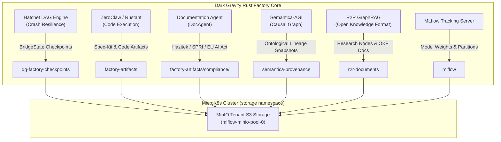

> [!NOTE]
> **UPSTREAM STATUS & FORK PURPOSE:**
> While upstream MinIO has archived the open-source community edition in favor of proprietary AIStor, this repository is **actively maintained and hardened** as an essential infrastructure component of the **[Dark Gravity Autonomous CA/CD Factory](https://github.com/lgcorzo/rust_CACD_autonomous_factory)**. Ongoing security patches, multi-stage container builds, and supply-chain integrity checks are continuously integrated to safeguard the autonomous software delivery lifecycle.

---

## 🛡️ Dark Gravity Factory: Security Maintenance & System Integrity Rationale

### 1. Why Security Maintenance Continues on this Repository

In the **Dark Gravity Autonomous CA/CD Software Factory (V7.2 / V7.3)**, MinIO is not merely a utility—it is the **foundational persistent Object Storage Fabric** for the entire autonomous engineering system.

Upstream MinIO's shift away from open-source community maintenance (`410 Gone` on legacy binary distributions) leaves unaddressed security vulnerabilities (CVEs) and orphaned dependency chains. In a zero-trust, autonomous multi-agent factory where AI agents autonomously synthesize, compile, and deploy software:
- **Supply-Chain & Runtime Integrity**: Unpatched storage vulnerabilities would compromise the integrity of compiled binaries, causal provenance records, and git mutations.
- **Air-Gapped Data Sovereignty**: Dark Gravity operates on sovereign, air-gapped infrastructure. Proprietary source code, AST mutations, and corporate memory must never escape the private network perimeter.
- **Continuous Compliance & Auditability**: Under regulations like the **EU AI Act (Art. 12 & 14)**, **SOC 2 Type II**, and **ISO/IEC 25059**, any breach or tampering with the underlying storage layer voids the factory's cryptographic proof-of-lineage.

Therefore, this repository is actively maintained to remediate security flaws, patch critical vulnerabilities, eliminate external third-party download dependencies, and provide robust CI/CD container builds tailored for production Kubernetes and MicroK8s environments.

---

### 2. Integration Architecture within Dark Gravity

MinIO is deeply embedded across the Dark Gravity architecture:



* **Cluster Topology & Service Endpoints**: Deployed in the `storage` Kubernetes namespace as `minio` and `mlflow-minio-pool-0` (`http://mlflow-minio-hl.storage.svc.cluster.local:9000`), managed natively via the MinIO Operator.
* **Rust Infrastructure Layer (`factory-infrastructure`)**: Integrated directly into the factory via `factory-infrastructure/src/s3.rs` through the `AwsS3Storage` adapter implementing the `S3Storage` trait (`put_object`, `get_object`).
* **Subsystem Dependencies**:
  1. **Hatchet Orchestrator Engine (`dg-factory-checkpoints`)**: Persists durable `BridgeState` step checkpoints. If an autonomous worker crashes or reaches gVisor memory limits (≤ 30 MiB), the worker immediately resumes from the last completed task in MinIO, preventing duplicate LLM prompt calls and eliminating token budget waste.
  2. **Semantica-AGI Causal Governance (`semantica-provenance`)**: Persists immutable snapshots of the causal decision graph, linking business requirements and GitLab/GitHub issues down to exact Abstract Syntax Tree (AST) line mutations.
  3. **R&D Compliance Packager (`factory-artifacts/compliance/`)**: Stores telemetry and auditable reports (compute core-hours, LiteLLM token spend, AST diff statistics, and Orphan Symbol Rate (OSR) metrics) formatted for **Hazitek, SPRI, and EU AI Act** audits.
  4. **R2R GraphRAG Corporate Memory (`r2r-documents`)**: Serves as the raw backing store for research nodes, Tavily web scrape outputs, and Google Open Knowledge Format (OKF) Markdown files.
  5. **MLflow Tracking Server (`mlflow`)**: Stores trained machine learning weights, dataset partitions, and experiment artifacts.

---

### 3. Critical Security Mechanisms Enforced

To protect the factory against compromise, the following defenses are strictly enforced:
- **Zero-Trust Path Traversal & Injection Defense**: In `factory-mcp-server`, MinIO object inspection tools enforce strict bucket whitelisting (`factory-artifacts`, `doc-agent-telemetry`, `r2r-documents`, `semantica-provenance`) and reject relative path sequences (`..` or `/`) to prevent path traversal and data exfiltration.
- **Cryptographic Provenance (NHI Verifiable Credentials)**: Every artifact and code modification is cryptographically signed by Non-Human Identities (NHI) using **W3C Verifiable Credentials** with **Ed25519** keys and deterministic BLAKE3/SHA-256 hashes. Tampering with any stored object in MinIO triggers immediate hash mismatch alerts and trips the Aethelgard SAST circuit breaker.
- **Automated Container Pipeline**: Fully automated multi-stage compilation using `golang:1.24-alpine` and lightweight Alpine 3.21 runtime, published to GHCR and the MicroK8s in-cluster registry (`localhost:32000`).

For MicroK8s deployment details, see **[MicroK8s Deployment Guide](docs/microk8s-deployment.md)**.

---

### 4. Sovereign MinIO Ecosystem: Maintained Repositories in `@lgcorzo`

To guarantee long-term sovereign support, full supply-chain independence, and continuous security patching for the Dark Gravity factory and production environments, the complete MinIO ecosystem of servers, clients, acceleration libraries, and core dependencies has been preserved and actively maintained under **`@lgcorzo`**:

| Category | Repository | Description | Key Capabilities |
| :--- | :--- | :--- | :--- |
| **Core Storage & Server** | [`lgcorzo/minio`](https://github.com/lgcorzo/minio) | High-performance Object Storage Server | Multi-tenant S3-compatible engine, Erasure Coding, Tiering, Decommissioning |
| | [`lgcorzo/mc`](https://github.com/lgcorzo/mc) | MinIO Client CLI Tool | High-speed mirror, diff, administration, encryption management, batch processing |
| | [`lgcorzo/kes`](https://github.com/lgcorzo/kes) | Key Encryption Server (KES) | High-performance KMS proxy (Vault, AWS-KMS, GCP-KMS, Azure Key Vault, Dev KMS) |
| | [`lgcorzo/console`](https://github.com/lgcorzo/console) | Graphical Web Administration Interface | Visual bucket policy management, IAM administration, observability metrics dashboard |
| **SDKs & APIs** | [`lgcorzo/minio-go`](https://github.com/lgcorzo/minio-go) | Official Go Client SDK | Idiomatic Go SDK for object storage operations, multipart uploads, STS, and presigned URLs |
| | [`lgcorzo/madmin-go`](https://github.com/lgcorzo/madmin-go) | MinIO Admin Go Library | Administrative APIs for server configuration, user management, healing, and decommissioning |
| | [`lgcorzo/kms-go`](https://github.com/lgcorzo/kms-go) | Cryptographic KMS Client Library | Go client primitives for key creation, DEK derivation, and envelope encryption via KES |
| | [`lgcorzo/pkg`](https://github.com/lgcorzo/pkg) | Common Go Utility Packages | Cryptographic certificates, hashing routines, and shared helper primitives |
| | [`lgcorzo/mtls`](https://github.com/lgcorzo/mtls) | Mutual TLS Utilities | Zero-trust inter-node cryptographic identity verification and mTLS configuration |
| **Hardware & SIMD Acceleration** | [`lgcorzo/sio`](https://github.com/lgcorzo/sio) | Data At Rest Encryption (DARE) | Streaming authenticated encryption format for secure on-disk persistence |
| | [`lgcorzo/md5-simd`](https://github.com/lgcorzo/md5-simd) | SIMD-Accelerated MD5 | Parallel AVX-512 and AVX2 MD5 calculation (up to 8x acceleration) |
| | [`lgcorzo/highwayhash`](https://github.com/lgcorzo/highwayhash) | SIMD HighwayHash | High-speed native hashing (>10 GB/s per core on Intel & ARM assembly) |
| | [`lgcorzo/crc64nvme`](https://github.com/lgcorzo/crc64nvme) | NVMe CRC64 SIMD Acceleration | Fast carryless-multiplication CRC64 checksums for NVMe storage devices |
| | [`lgcorzo/simdjson-go`](https://github.com/lgcorzo/simdjson-go) | High-Throughput SIMD JSON Parser | Gigabytes/sec JSON parsing leveraging vector instructions for event & metadata processing |
| **Networking & Routing** | [`lgcorzo/mux`](https://github.com/lgcorzo/mux) | High-Performance Request Router | Matcher and multiplexer for incoming S3 REST and STS API routes |
| | [`lgcorzo/websocket`](https://github.com/lgcorzo/websocket) | Low-Latency WebSocket Engine | High-throughput duplex communication for real-time console and bucket notifications |
| | [`lgcorzo/dnscache`](https://github.com/lgcorzo/dnscache) | DNS Lookup Caching | In-memory DNS cache minimizing latency on distributed multi-cluster lookups |
| **Data Formats & Helpers** | [`lgcorzo/zipindex`](https://github.com/lgcorzo/zipindex) | Fast ZIP Archive Indexer | Compressed index lookup enabling direct random reads of files inside ZIP archives |
| | [`lgcorzo/xxml`](https://github.com/lgcorzo/xxml) | Extended XML 1.0 Parser | Robust XML namespace and control character support for strict S3 API compliance |
| | [`lgcorzo/colorjson`](https://github.com/lgcorzo/colorjson) | Colorized JSON Encoder | Human-readable terminal logging and JSON inspection |
| | [`lgcorzo/csvparser`](https://github.com/lgcorzo/csvparser) | High-Performance CSV Parser | Streaming CSV parsing engine for S3 Select query execution |
| | [`lgcorzo/filepath`](https://github.com/lgcorzo/filepath) | Lexically Sorted Flat Path Walker | High-efficiency directory walking and flat object key enumeration |
| | [`lgcorzo/selfupdate`](https://github.com/lgcorzo/selfupdate) | Binary Self-Updating Library | Secure signature-verified self-upgrades for CLI binaries |
| | [`lgcorzo/cli`](https://github.com/lgcorzo/cli) | Minimalist CLI Framework | Lightweight command-line argument parser for distributed helper utilities |
| **Testing & Tooling** | [`lgcorzo/mint`](https://github.com/lgcorzo/mint) | Integration Test & Verification Suite | End-to-end multi-language test suite certifying S3 protocol and functional compliance |
| | [`lgcorzo/dperf`](https://github.com/lgcorzo/dperf) | Distributed Performance Benchmark | Stress-testing network bandwidth, disk I/O, and CPU throughput across storage nodes |
| | [`lgcorzo/minio-cf`](https://github.com/lgcorzo/minio-cf) | Cloud Foundry Integration | Support for deploying and orchestrating MinIO within Cloud Foundry estates |

---

# MinIO Quickstart Guide

[](https://slack.min.io) [](https://hub.docker.com/r/minio/minio/) [](https://github.com/lgcorzo/minio/blob/master/LICENSE)

[](https://min.io)

MinIO is a high-performance, S3-compatible object storage solution released under the GNU AGPL v3.0 license.
Designed for speed and scalability, it powers AI/ML, analytics, and data-intensive workloads with industry-leading performance.

- S3 API Compatible – Seamless integration with existing S3 tools
- Built for AI & Analytics – Optimized for large-scale data pipelines
- High Performance – Ideal for demanding storage workloads.

This README provides instructions for building MinIO from source and deploying onto baremetal hardware.
Use the [MinIO Documentation](https://github.com/lgcorzo/docs) project to build and host a local copy of the documentation.

## MinIO is Open Source Software

We designed MinIO as Open Source software for the Open Source software community. We encourage the community to remix, redesign, and reshare MinIO under the terms of the AGPLv3 license.

All usage of MinIO in your application stack requires validation against AGPLv3 obligations, which include but are not limited to the release of modified code to the community from which you have benefited. Any commercial/proprietary usage of the AGPLv3 software, including repackaging or reselling services/features, is done at your own risk.

The AGPLv3 provides no obligation by any party to support, maintain, or warranty the original or any modified work.
All support is provided on a best-effort basis through Github and our [Slack](https://slack.min.io) channel, and any member of the community is welcome to contribute and assist others in their usage of the software.

MinIO [AIStor](https://www.min.io/product/aistor) includes enterprise-grade support and licensing for workloads which require commercial or proprietary usage and production-level SLA/SLO-backed support. For more information, [reach out for a quote](https://min.io/pricing).

## Source-Only Distribution

**Important:** The MinIO community edition is now distributed as source code only. We will no longer provide pre-compiled binary releases for the community version.

### Installing Latest MinIO Community Edition

To use MinIO community edition, you have two options:

1. **Install from source** using `go install github.com/lgcorzo/minio@latest` (recommended)
2. **Build a Docker image** from the provided Dockerfile

See the sections below for detailed instructions on each method.

### Legacy Binary Releases

Historical pre-compiled binary releases remain available for reference but are no longer maintained:

- GitHub Releases: https://github.com/lgcorzo/minio/releases
- Direct downloads: https://dl.min.io/server/minio/release/

**These legacy binaries will not receive updates.** We strongly recommend using source builds for access to the latest features, bug fixes, and security updates.

## Install from Source

Use the following commands to compile and run a standalone MinIO server from source.
If you do not have a working Golang environment, please follow [How to install Golang](https://golang.org/doc/install). Minimum version required is [go1.24](https://golang.org/dl/#stable)

```sh
go install github.com/lgcorzo/minio@latest
```

You can alternatively run `go build` and use the `GOOS` and `GOARCH` environment variables to control the OS and architecture target.
For example:

```
env GOOS=linux GOARCH=arm64 go build
```

Start MinIO by running `minio server PATH` where `PATH` is any empty folder on your local filesystem.

The MinIO deployment starts using default root credentials `minioadmin:minioadmin`.
You can test the deployment using the MinIO Console, an embedded web-based object browser built into MinIO Server.
Point a web browser running on the host machine to <http://127.0.0.1:9000> and log in with the root credentials.
You can use the Browser to create buckets, upload objects, and browse the contents of the MinIO server.

You can also connect using any S3-compatible tool, such as the MinIO Client `mc` commandline tool:

```sh
mc alias set local http://localhost:9000 minioadmin minioadmin
mc admin info local
```

See [Test using MinIO Client `mc`](#test-using-minio-client-mc) for more information on using the `mc` commandline tool.
For application developers, see <https://docs.min.io/enterprise/aistor-object-store/developers/sdk/> to view MinIO SDKs for supported languages.

> [!NOTE]
> Production environments using compiled-from-source MinIO binaries do so at their own risk.
> The AGPLv3 license provides no warranties nor liabilities for any such usage.

## Build Docker Image

This repository features a fully self-contained multi-stage `Dockerfile` that builds both `minio` and the MinIO Client (`mc`) directly from source, producing a hardened Alpine 3.21 runtime container.

### Local Multi-Stage Build
You can build the container image directly without any pre-requisites:

```sh
docker build -t minio:latest .
```

### MicroK8s In-Cluster Deployment
To build and deploy directly into your MicroK8s local cluster:

```sh
# Push to MicroK8s in-cluster registry (localhost:32000)
./scripts/deploy-to-microk8s.sh registry microk8s-latest

# Or import directly into MicroK8s containerd
./scripts/deploy-to-microk8s.sh import microk8s-latest
```

### Automated CI/CD Pipeline
Every push to `master` and `feat/**` branches automatically triggers [`.github/workflows/docker-publish.yml`](.github/workflows/docker-publish.yml), publishing verified images to GitHub Container Registry:
- `ghcr.io/lgcorzo/minio:latest`
- `ghcr.io/lgcorzo/minio:microk8s-latest`
- `ghcr.io/lgcorzo/minio:<git-sha>`

For full Kubernetes Tenant manifests and deployment instructions, refer to **[docs/microk8s-deployment.md](docs/microk8s-deployment.md)**.

## Install using Helm Charts

There are two paths for installing MinIO onto Kubernetes infrastructure:

- Use the [MinIO Operator](https://github.com/lgcorzo/operator)
- Use the community-maintained [Helm charts](https://github.com/lgcorzo/minio/tree/master/helm/minio)

See the [MinIO Documentation](https://docs.min.io/community/minio-object-store/operations/deployments/kubernetes.html) for guidance on deploying using the Operator.
The Community Helm chart has instructions in the folder-level README.

## Test MinIO Connectivity

### Test using MinIO Console

MinIO Server comes with an embedded web based object browser.
Point your web browser to <http://127.0.0.1:9000> to ensure your server has started successfully.

> [!NOTE]
> MinIO runs console on random port by default, if you wish to choose a specific port use `--console-address` to pick a specific interface and port.

### Test using MinIO Client `mc`

`mc` provides a modern alternative to UNIX commands like ls, cat, cp, mirror, diff etc. It supports filesystems and Amazon S3 compatible cloud storage services.

The following commands set a local alias, validate the server information, create a bucket, copy data to that bucket, and list the contents of the bucket.

```sh
mc alias set local http://localhost:9000 minioadmin minioadmin
mc admin info
mc mb data
mc cp ~/Downloads/mydata data/
mc ls data/
```

Follow the MinIO Client [Quickstart Guide](https://docs.min.io/community/minio-object-store/reference/minio-mc.html#quickstart) for further instructions.

## Explore Further

- [The MinIO documentation website](https://docs.min.io/community/minio-object-store/index.html)
- [MinIO Erasure Code Overview](https://docs.min.io/community/minio-object-store/operations/concepts/erasure-coding.html)
- [Use `mc` with MinIO Server](https://docs.min.io/community/minio-object-store/reference/minio-mc.html)
- [Use `minio-go` SDK with MinIO Server](https://docs.min.io/enterprise/aistor-object-store/developers/sdk/go/)

## Contribute to MinIO Project

Please follow MinIO [Contributor's Guide](https://github.com/lgcorzo/minio/blob/master/CONTRIBUTING.md) for guidance on making new contributions to the repository.

## License

- MinIO source is licensed under the [GNU AGPLv3](https://github.com/lgcorzo/minio/blob/master/LICENSE).
- MinIO [documentation](https://github.com/lgcorzo/minio/tree/master/docs) is licensed under [CC BY 4.0](https://creativecommons.org/licenses/by/4.0/).
- [License Compliance](https://github.com/lgcorzo/minio/blob/master/COMPLIANCE.md)
